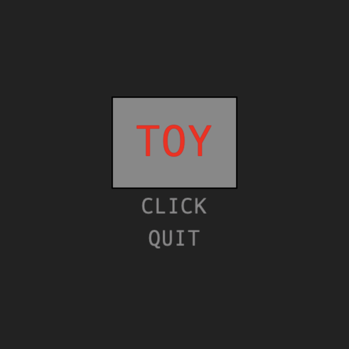
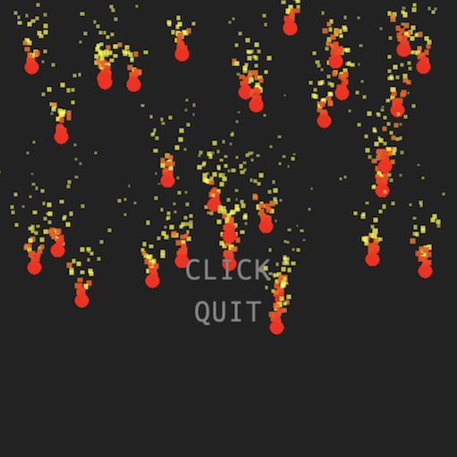
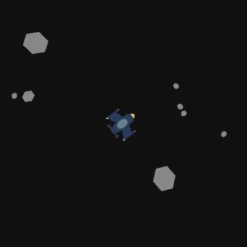
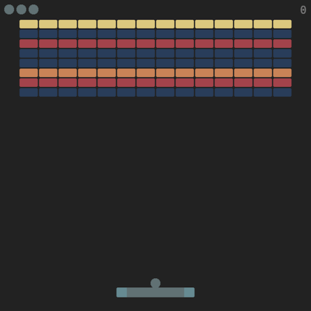

# Toy

v0.3

2d Engine on top of PixiJS

# Hello World

1. Clone repository

2. Run index.html



# Generate balls

1. Make dir objects/ with the file ball.js

2. Add code in the file ball.js

``` js
// ball.js
'use strict'

export class Ball extends Shape {
    setup(type) {
        this.applyForce(new Vector(0, 256));
    }

    update(dt) {
        super.update(dt);
        this.applyMove(dt);
    }
}
```
Notes:
- Engine saves new user classes in GG.objects.
- Engine saves default GUI classes in GG.objects.
- Avoid same name for classes.

3. Load class Ball to the Engine in the main.js

``` js
LoadSystem.objects(
    [
        'objects/ball.js'
    ]
);

```
Notes:
- Use main.js to load images, sounds, objects and scenes.
- The initLoop function in main.js is an entry point for the app.

``` js
SceneSystem.init('Start', {}, true);

```
- Start is a name of the scene which runs after the app started.


4. Create method addBalls for the class Start in the file start.js

``` js
addBalls() {
    for (let i=0; i<8; i++) {
        const x = Tools.randomRange(
            16, GG.app.renderer.view.width-16
        );
        const y = Tools.randomRange(
            -128, 16
        );

        const ball = new GG.objects.Ball(
            'ball', this, x, y,
            {
                shape: 'circle',
                wid: 8,
                hei: 8,
                fillColor: Settings.colors.red,
                dynamic: true
            }
        );
    }
}
```

5. Update callback for the clickButton in the class Start

``` js
callback: () => {
    title.setVisible(false);
    this.addBalls();
}
```

6. Run index.html and press CLICK button

7. Set timer for the balls in the method setup in the class Ball

``` js
const delay = Tools.randomRange(2000, 4000);
this.scene.timer.after(delay, () => {
    this.setDead(true);
});
```

8. Class Ball with a trail and updated method destroy

``` js
// ball.js
'use strict'

export class Ball extends Shape {
    setup(type) {
        this.applyForce(new Vector(0, 256));

        const delay = Tools.randomRange(2000, 4000);
        this.lifetime = this.scene.timer.after(delay, () => {
            this.setDead(true);
        });

        this.trail = new ParticleSystem('ps', this);
        this.trail.setParticle({
            texture: GG.Texture.WHITE,
            color: [
                Settings.colors.red,
                Settings.colors.yellow,
                Settings.colors.white
            ],
            scale: [0.4, 0],
            alpha: [1, 0],
            time: [0.5, 1],
            spread: 30,
            direction: new Vector(0, -1),
            speed: [4, 8],
        });

        this.trail.setEmission(8);
        this.trail.play();
    }

    update(dt) {
        super.update(dt);
        this.applyMove(dt);
    }

    destroy() {
        if (this.lifetime) {
            this.lifetime.stop();
            this.lifetime = null;
        }

        this.trail.setDead(true);
        super.destroy();
    }
}
````

9. Run index.html and press CLICK button



# Examples

Check out examples/

## Asteroids



## Breakout




